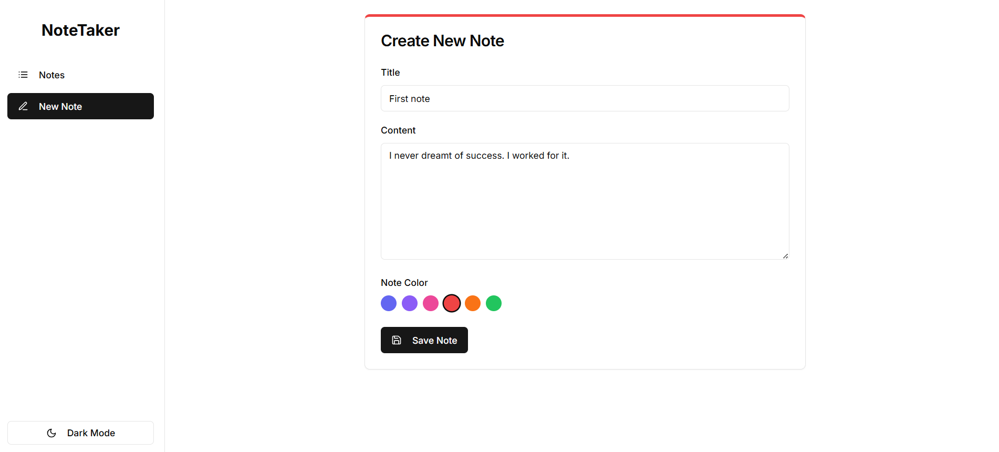
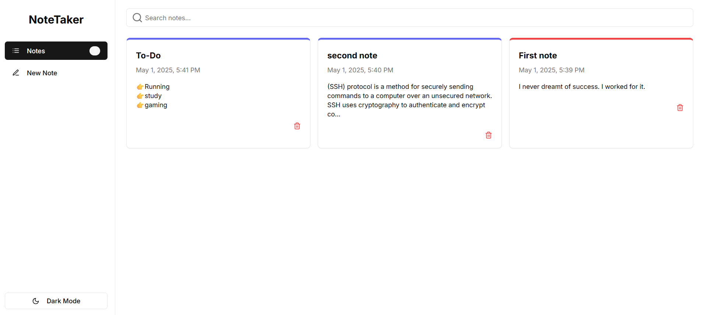

# NoteTaker App

A simple note-taking application built with Next.js that persists data in localStorage.

 **Live Demo**: 👉[note taker app](https://v0-react-note-app-tau.vercel.app/)

## Setup & Run Steps

1. Clone the repository
2. Install dependencies:
   \`\`\`
   npm install
   \`\`\`
3. Configure frontend environment (create `.env`):
   ```
   NEXT_PUBLIC_API_URL=http://localhost:8000
   NEXT_PUBLIC_API_KEY=enter your generated API key here
   ```
4. Run the development server:
   \`\`\`
   npm run dev
   \`\`\`
5. Open [http://localhost:3000](http://localhost:3000) in your browser

## Sreenshots



## Design Decisions

### Storage Strategy
- **Why localStorage + key naming**: localStorage provides persistent client-side storage that survives page refreshes and browser sessions. Using a namespaced key (`noteTaker.notes`) prevents collisions with other applications using localStorage.

### Component Design
- **Why separate components**: The app is structured with distinct components (AddNote, NotesList, NoteItem) to maintain separation of concerns, improve code readability, and enable easier maintenance.
- **Why controlled inputs**: Form inputs in AddNote are controlled components to maintain a single source of truth for the form state, enabling easy validation and submission handling.

### State Management
- **Why useState + useEffect**: Simple React hooks provide sufficient state management for this application size. useState manages local component state, while useEffect handles side effects like loading data from localStorage on mount.
- **Why centralized notes state**: The main notes array is managed in the parent component and passed down as props, creating a clear data flow and making it easier to add features like filtering or sorting later.

### Styling
- **Why Tailwind CSS**: Tailwind provides utility-first CSS that speeds up development with pre-defined classes, consistent design tokens, and eliminates the need to write and maintain custom CSS.
- **Why shadcn/ui components**: These accessible, reusable components provide a consistent design language and reduce development time while ensuring good accessibility practices.

### Navigation
- **Why tabs for navigation**: Tabs provide a simple, intuitive way to switch between viewing and adding notes without page transitions, maintaining a single-page application feel that's familiar to users.

### Error & Loading States
- **Why show spinner during loading**: Visual feedback during data loading improves user experience by indicating that the application is working.
- **Why display error banners**: Clear error messages help users understand when something goes wrong and potentially how to resolve it, improving overall usability.
